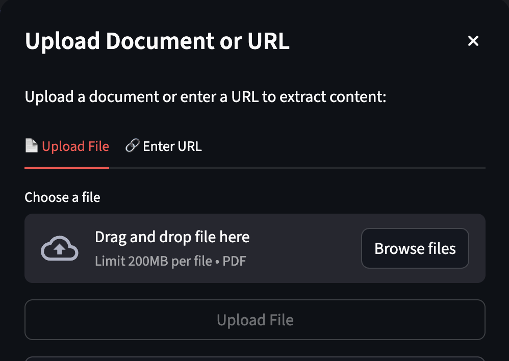

# Agentic AI-Powered Social Media Content Generator

## 📌 Overview

## 🚀 Key Features

- 📝 Multi-platform content generation (LinkedIn, Medium)
- 📄 PDF and YouTube transcript extraction
- 🧠 Context-aware generation with RAG
- 🔄 Multi-stage agentic workflows with LangGraph
- 💾 Persistent memory with ChromaDB
- 🎨 Interactive Streamlit UI

# UI

  

# Chat Creation and Document Ingestion

  
  

###  Technology Stack

| Components         | Technology              | Purpose                         |
|--------------------|-------------------------|----------------------------------|
| Frontend           | Streamlit               | Interactive Web Interface        |
| Backend            | Python                  | Application Logic                |
| Primary Database   | MongoDB                 | Chat and Message Database        |
| Vector Database    | ChromaDB                | Context Retrieval                |
| LLM                | Ollama (Llama3.2)       | Content Generation               |
| Agentic Workflow   | LangGraph               | Multi-agent Workflows            |
| LLM Framework      | LangChain               | LLM Abstractions                 |

## Core Functionality

### 1. Multi-Platform Content Generation
The system generates platform-specific content tailored to different social media platforms such as **Medium** and **LinkedIn**. Each platform follows a dedicated agentic workflow to ensure tone, structure, and formatting align with platform best practices.

---

### 2. Raw Content Extraction
Users can upload or provide external sources as input:
- **PDF Documents** – Text is extracted page-by-page using PyPDF2.
- **YouTube Videos** – Transcripts are fetched using the YouTube Transcript API.

All extracted content is cleaned, structured, and stored for downstream AI processing.

---

### 3. Agentic AI Workflow (LangGraph)
The project uses a **multi-agent workflow architecture** built with LangGraph.  
Each workflow is divided into intelligent stages such as:
- Analysis & outline generation  
- Draft creation  
- Refinement and polishing  

This enables structured reasoning, iterative improvements, and autonomous execution.

---

### 4. Context-Aware Content Generation (RAG)
The system implements **Retrieval-Augmented Generation (RAG)** using:
- **ChromaDB** for vector-based semantic search  
- **Sentence-Transformers (all-MiniLM-L6-v2)** for embeddings  

Relevant past messages and extracted content are retrieved and injected into prompts before generating responses.

---

### 5. Short-Term & Long-Term Memory
- **Short-Term Memory**: Maintained within the active LangGraph session to preserve conversational flow.
- **Long-Term Memory**: Stored persistently in ChromaDB, enabling the system to recall relevant context across sessions.

This dual-memory architecture ensures coherent and continuous interactions.

---

### 6. LLM-Powered Content Generation
The system runs **LLaMA 3.2 locally via Ollama**, enabling:
- Fast inference without external APIs
- Privacy-preserving execution
- Platform-specific prompt control using LangChain abstractions

---

### 7. Persistent Data Storage
- **MongoDB** stores chat metadata, messages, extracted content, and timestamps.
- Enables chat history recovery, session continuation, and structured data management.

---

### 8. Interactive Streamlit User Interface
A Streamlit-based web interface provides:
- Chat creation and management
- PDF & YouTube content upload
- Real-time content generation
- Session control and chat deletion

The UI is designed for simplicity, responsiveness, and ease of use.

