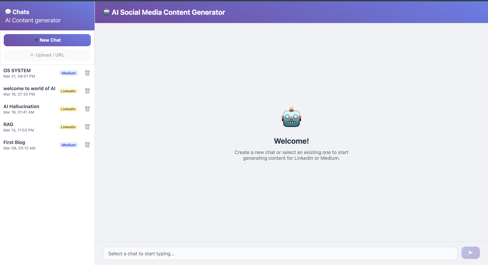
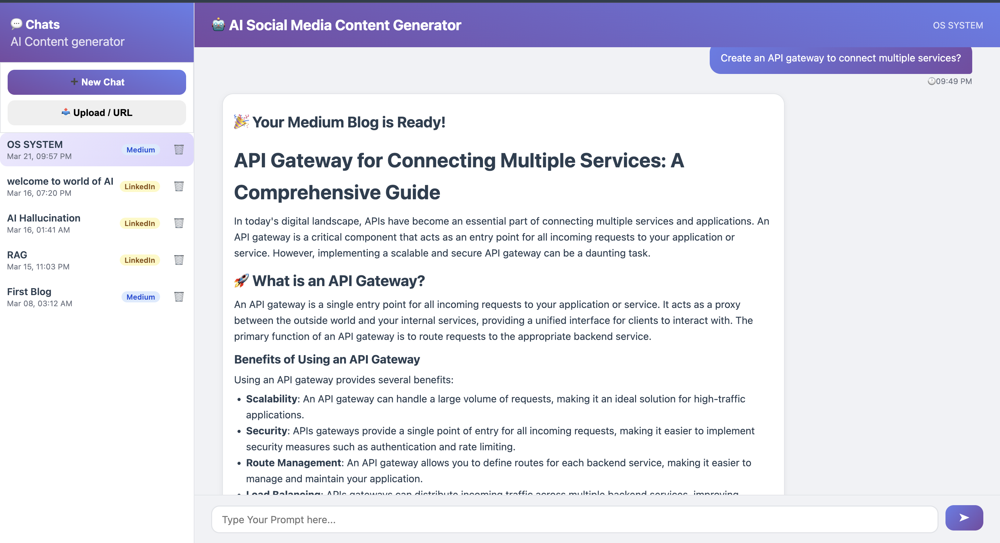
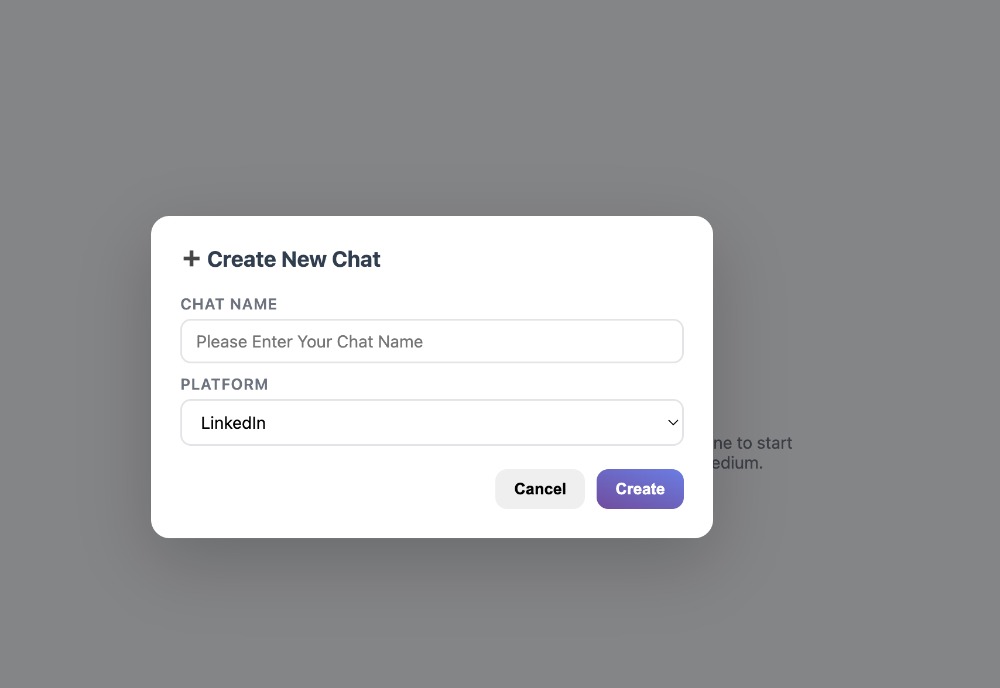
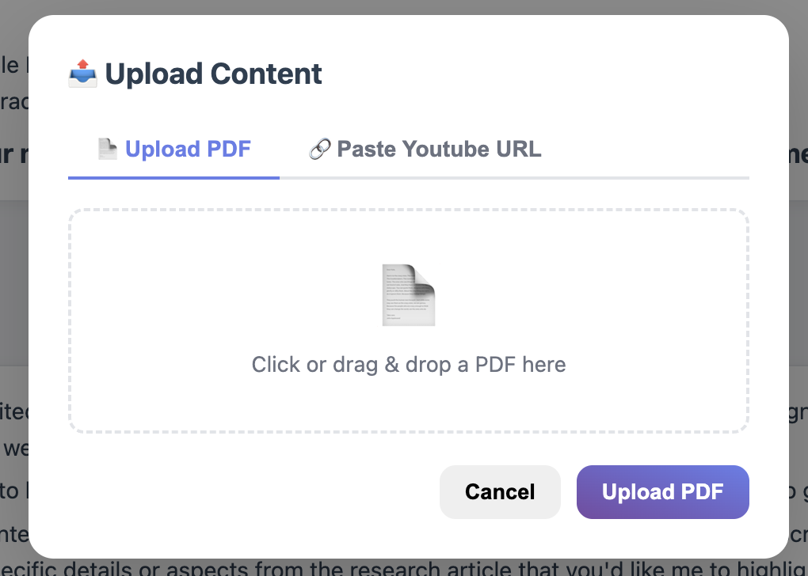

# Agentic AI-Powered Social Media Content Generator

## 📌 Overview

An intelligent agentic AI system that automates social media content generation using LangGraph workflows and Llama 3.2. The system extracts insights from PDFs and YouTube videos, maintains conversational context through vector-based memory, and generates platform-optimized content for LinkedIn and Medium with minimal human intervention.

## 🚀 Key Features

- 📝 Multi-platform content generation (LinkedIn, Medium)
- 📄 PDF and YouTube transcript extraction
- 🧠 Context-aware generation with RAG
- 🔄 Multi-stage agentic workflows with LangGraph
- 💾 Persistent memory with ChromaDB
- 🌐 REST API with FastAPI
- 🎨 Interactive HTML/CSS/JS UI


# UI

<p align="center">
  
</p>


# Content Generation

<p align="center">
  
</p>

# Document Upload and chat Creation

<p align="center">
  
  
</p>

###  Technology Stack

| Components         | Technology              | Purpose                          |
|--------------------|-------------------------|----------------------------------|
| Frontend           | HTML, CSS, JavaScript   | Interactive Web Interface        |
| Backend            | FastAPI (Python)        | REST API                         |
| Primary Database   | MongoDB                 | Chat and Message Database        |
| Vector Database    | ChromaDB                | Context Retrieval                |
| LLM                | Ollama (Llama3.2)       | Content Generation               |
| Agentic Workflow   | LangGraph               | Multi-agent Workflows            |
| LLM Framework      | LangChain               | LLM Abstractions                 |


## Core Functionality

### 1. Multi-Platform Content Generation
The system generates platform-specific content tailored to different social media platforms such as **Medium** and **LinkedIn**. Each platform follows a dedicated agentic workflow to ensure tone, structure, and formatting align with platform best practices.

---

### 2. Raw Content Extraction
Users can upload or provide external sources as input:
- **PDF Documents** – Text is extracted page-by-page using PyPDF2.
- **YouTube Videos** – Transcripts are fetched using the YouTube Transcript API.

All extracted content is cleaned, structured, and stored for downstream AI processing.

---

### 3. Agentic AI Workflow (LangGraph)
The project uses a **multi-agent workflow architecture** built with LangGraph.  
Each workflow is divided into intelligent stages such as:
- Analysis & outline generation  
- Draft creation  
- Refinement and polishing  

This enables structured reasoning, iterative improvements, and autonomous execution.

---

### 4. Context-Aware Content Generation (RAG)
The system implements **Retrieval-Augmented Generation (RAG)** using:
- **ChromaDB** for vector-based semantic search  
- **Sentence-Transformers (all-MiniLM-L6-v2)** for embeddings  

Relevant past messages and extracted content are retrieved and injected into prompts before generating responses.

---

### 5. Short-Term & Long-Term Memory
- **Short-Term Memory**: Maintained within the active LangGraph session to preserve conversational flow.
- **Long-Term Memory**: Stored persistently in ChromaDB, enabling the system to recall relevant context across sessions.

This dual-memory architecture ensures coherent and continuous interactions.

---

### 6. LLM-Powered Content Generation
The system runs **LLaMA 3.2 locally via Ollama**, enabling:
- Fast inference without external APIs
- Privacy-preserving execution
- Platform-specific prompt control using LangChain abstractions

---

### 7. Persistent Data Storage
- **MongoDB** stores chat metadata, messages, extracted content, and timestamps.
- Enables chat history recovery, session continuation, and structured data management.

---

### 8. Web-Based User Interface (HTML, CSS, JavaScript)

A custom-built web interface using HTML, CSS, and JavaScript provides:

- Chat creation and management
- PDF and YouTube content upload
- Real-time content generation via API calls
- Session handling and chat deletion

The frontend communicates with a FastAPI backend through RESTful APIs, ensuring a responsive and interactive user experience. The interface is designed for simplicity, usability, and efficient content interaction.

## Getting Started

Follow the steps below to set up and run the project locally.

---

### Prerequisites

Ensure the following are installed on your system:

- **Python 3.10 or higher**
- **Ollama** (for running LLaMA 3.2 locally)
- **MongoDB** (Local or MongoDB Atlas)
- **ChromaDB** (For Vector Data Storage)
- **Git**
- (Optional) **Local GPU** for faster inference

---

### Installation

1. **Clone the repository**
    ```bash
    git clone <repository-url>
    ```

2. **Install Python dependencies:**
   ```bash
   pip install -r requirements.txt
   ```
3. **LLM Setup**
   - Install Ollama from: https://ollama.com
   - Pull the required model:
     ```bash
     ollama pull llama3.2
     ```
     ```bash
     ollama serve
     ```

4. **Database Setup**
    - MongoDB can be configured in either of the following ways:
        Run MongoDB locally
        Use MongoDB Atlas and update the connection URI in the project

5. **Running the Application**
    1. **Start Ollama**
    ```bash
      ollama serve
    ```

    2. **Start Backend**
    ```bash
      cd Backend
      python3 -m uvicorn fast:app --reload
    ```

    3. **Open Frontend**
      - Open `Frontend/Index.html` with Live Server in VS Code
      - OR open directly in browser

      The API will be available at `http://localhost:8000`

## 📞 Support

- **Issues:** Create GitHub issues for bugs or feature requests
- **Discussions:** Use GitHub Discussions for questions and ideas
- **Documentation:** Check the codebase for implementation details

## 👨🏻‍💻 Authors
Meet Patel 

